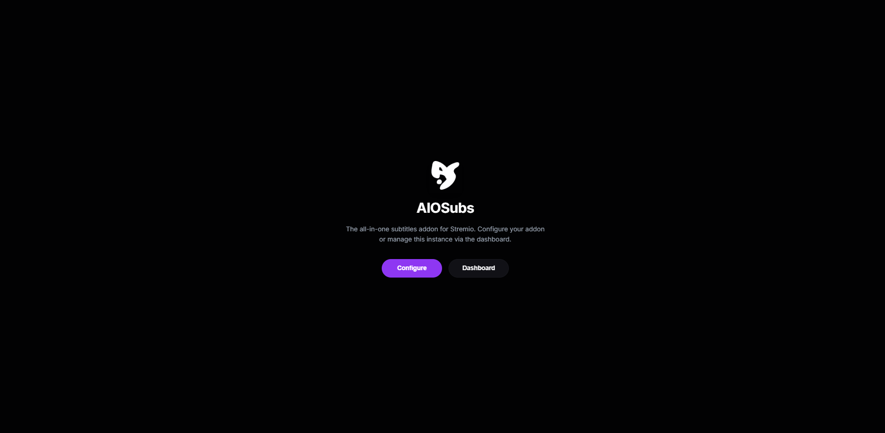

<div align="center">


# AIOSubs

**Universal subtitle aggregator for Stremio & Nuvio**


[](https://supabase.com/)

[](https://opensource.org/licenses/MIT)
[](https://render.com/)

<p align="center">
    <a href="https://github.com/Augustofabg/aio-subtitles/actions/workflows/docker-build.yml">
        
    </a>
   <a href="https://github.com/Augustofabg/aio-subtitles/releases/latest">
        
    </a>
    <a href="https://github.com/Augustofabg/aio-subtitles/stargazers">
        
    </a>
    <a href="https://github.com/Augustofabg/aio-subtitles/network/members">
        
    </a>
</p>

</div>

## What is AIOSubs?

AIOSubs was built to give you total control over subtitles in Stremio or Nuvio. Instead of juggling multiple subtitle addons, each with its own configuration and limitations, AIOSubs works as a central hub. It pulls results from all your configured sources, then deduplicates, filters, remaps languages, and formats everything according to your rules, delivering a single clean list right inside the player.

Whether you're a casual user who just wants a tidy subtitle list, or someone who likes fine-tuning every detail, AIOSubs adapts to you.

The configuration interface follows the same dark theme with purple accents made popular by **AIOStreams**. If you already use AIOStreams, the workflow will feel familiar.




## 📑 Table of Contents

- [Features](#-features)
- [How to run](#-how-to-run)
- [Deploy on Render](#-deploy-on-render)
- [Environment variables](#️-environment-variables)
- [Tests](#-tests)
<br>

## ✨ Features

<table>
<tr>
<td width="50%" valign="top">

**- AIOStreams-style interface**
Home screen with two paths: `Configure`, to start from scratch, or `Dashboard`, to load a saved configuration via UUID + password. A step-by-step wizard guides the whole setup, with no visual clutter.

**- Native providers with real-time validation**
Official support for **OpenSubtitles.com** (API v1), **SubDL**, and **Subsource**, each with its own field for the API key. The OpenSubtitles key is validated live (`✓ / ✗`), testing the actual connection to the service before proceeding.

**- Free-form addon import**
Paste the URL of any Stremio subtitle addon's `manifest.json` and AIOSubs imports it automatically. It detects the name and icon, and checks whether the addon actually exposes the `subtitles` resource. Each one can be enabled/disabled individually, with an option for parallel search across all of them.

</td>
<td width="50%" valign="top">

**- No more "Unknown" subtitles**
Language whitelist with flags (🇧🇷 `pob`, 🇵🇹 `por`, 🇺🇸 `eng`...). Remapping rules automatically unify regional variants (`pt-br` → `pob`, `pt` → `por`), and everything is canonicalized to **ISO 639-2** — no more broken tabs in the player.

**- Smart deduplication**
Compare by content hash, fuzzy release-name similarity (85%+), or both combined. Then simply reorder providers and addons by priority by dragging them in the list.

**- Secure persistence**
Configurations are saved in **Supabase**, with fallback to traditional PostgreSQL or a local file in development. Passwords are never stored in plain text — everything goes through **bcrypt** hashing before being saved.

</td>
</tr>
</table>

**📱 Install in seconds:** direct buttons for Stremio Desktop and Web, plus a QR Code generated on the spot to install on Nuvio or Stremio mobile without typing anything.

---

## 🚀 How to run

### Locally, with Node.js

Prerequisites: **Node.js 20+** and **Git**.

```bash
# Clone the repository
git clone https://github.com/Augustofabg/aio-subtitles.git
cd aio-subtitles

# Install dependencies
npm install

# (Optional) set up environment variables
cp .env.example .env

# Build the project
npm run build

# Development mode (with auto-reload)
npm run dev

# Or production
npm start
```

Addresses available after starting:

| Resource | URL |
| :--- | :--- |
| Configuration interface | `http://localhost:7000/configure` |
| Default manifest | `http://localhost:7000/manifest.json` |
| Health check | `http://localhost:7000/health` |

### With Docker

The repository includes a multi-stage `Dockerfile` based on Alpine, running with a non-privileged user.

```bash
docker build -t aio-subtitles .

docker run -d \
  -p 7000:7000 \
  --name aio-subtitles \
  --restart unless-stopped \
  aio-subtitles
```

### With Docker Compose

```bash
docker compose up -d

# Follow the logs
docker compose logs -f
```

---

## 🌐 Deploy on Render

> [!TIP]
> **Why Render?**
> - **Automatic HTTPS** — Stremio Web and modern apps require a secure connection, and Render provides this for free.
> - **Always online** — no need to keep your own computer running 24/7.
> - **Zero network configuration** — no port forwarding, NAT, or DDNS required.
> - **Direct Supabase integration** — configurations persist across deploys.
> - **Continuous deployment** — every push to the `main` branch automatically ships a new version.

**1. Create the database on Supabase**
1. Create a free account at [supabase.com](https://supabase.com/).
2. Create a new project (e.g., `aiosubs-db`).
3. In **Project Settings → API**, copy the **Project URL** and the **anon/service_role key**.

**2. Create the web service on Render**
1. Create an account at [render.com](https://render.com/).
2. From the dashboard, click **New + → Web Service** and connect the `aio-subtitles` repository (branch `main`).
3. Fill in:

   | Field | Value |
   | :--- | :--- |
   | Name | `aio-subtitles` (or a name of your choice) |
   | Region | The one closest to you |
   | Branch | `main` |
   | Runtime | `Node` |
   | Build Command | `npm run render-build` |
   | Start Command | `npm start` |
   | Instance Type | `Free` |

**3. Set the environment variables**

| Variable | Value | Description |
| :--- | :--- | :--- |
| `PORT` | `7000` | Internal port the server listens on |
| `NODE_ENV` | `production` | Runtime environment |
| `BASE_URL` | `https://your-app.onrender.com` | Public URL generated by Render |
| `SUPABASE_URL` | `https://xxxxxxxxxxxx.supabase.co` | URL of your Supabase project |
| `SUPABASE_KEY` | `your-key-here` | Supabase API key |
| `CACHE_TTL_MINUTES` | `30` | Cache duration for searches |

> [!NOTE]
> Want to offer default keys for users who don't want to set up their own? Also add `OPENSUBTITLES_API_KEY` and `SUBDL_API_KEY`.

**4. Deploy**
Click **Deploy Web Service** and wait for the build to finish — the log will show `🚀 AIOSubtitles Stremio Addon listening...`. Go to the generated URL at `/configure`, set things up through the interface, copy the link or scan the QR Code. Subtitles ready anywhere. 🎉

---

## ⚙️ Environment variables

| Variable | Default | Description |
| :--- | :--- | :--- |
| `PORT` | `7000` | Port the HTTP server listens on |
| `HOST` | `0.0.0.0` | Network listening host |
| `BASE_URL` | `""` | Public absolute URL of the application |
| `SUPABASE_URL` | `""` | URL of the Supabase instance |
| `SUPABASE_KEY` | `""` | Public/secret Supabase API key |
| `DATABASE_URL` | `""` | Alternative connection string for PostgreSQL |
| `OPENSUBTITLES_API_KEY` | `""` | Server-level fallback OpenSubtitles key |
| `SUBDL_API_KEY` | `""` | Server-level fallback SubDL key |
| `CACHE_TTL_MINUTES` | `30` | Duration of the results LRU cache |
| `RATE_LIMIT_MAX` | `150` | Maximum requests per minute |
| `NODE_ENV` | `development` | Runtime environment |

---

## 🧪 Tests

Test suite covering the entire pipeline, from provider to final subtitle delivery:

```bash
npm test                    # Run everything at once

npm run test:providers      # Native providers and ISO 639-2 normalization
npm run test:formatter      # Formatting and cleanup for players (Nuvio)
npm run test:alignment      # Alignment/sync with fallback
npm run test:supabase       # Cloud persistence and bcrypt security
npm run test:validation     # Interface flow and OpenSubtitles headers
```

## ⚠️ Disclaimer

AIOSubs is a tool for aggregating and managing data from other Stremio subtitle addons. It does not host, store, or distribute any content. The developer does not endorse or promote access to copyrighted content. Users are solely responsible for complying with all applicable laws and the terms of service of any addons or services they use with AIOSubs.

## 🙏 Credits

This project wouldn't be possible without the foundational work of many others in the community, especially those who develop the addons that AIOSubs integrates. Special thanks to **[AIOStreams](https://github.com/Viren070/AIOStreams)**, the project that served as a direct inspiration for AIOSubs' interface and aggregation philosophy, to the developers of all integrated addons, and to the open-source projects that inspired parts of AIOSubs' design.
